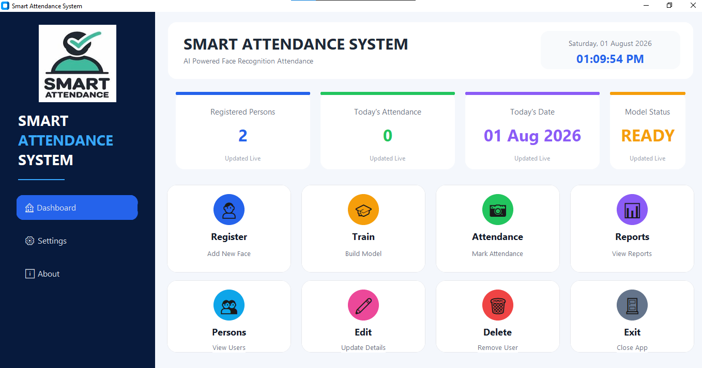
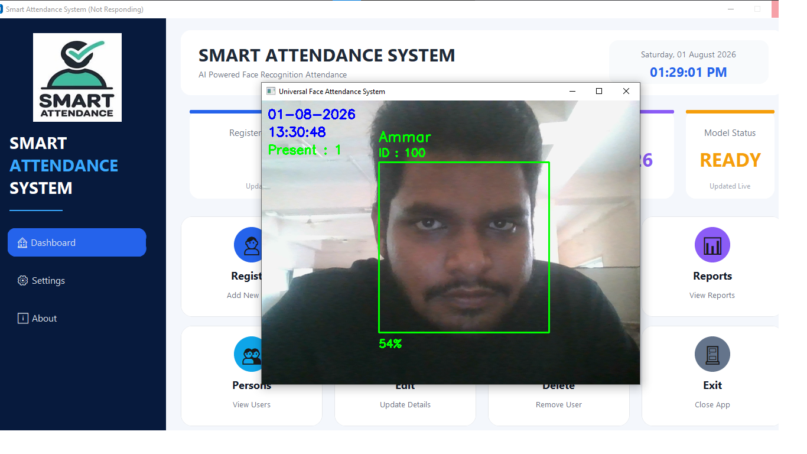
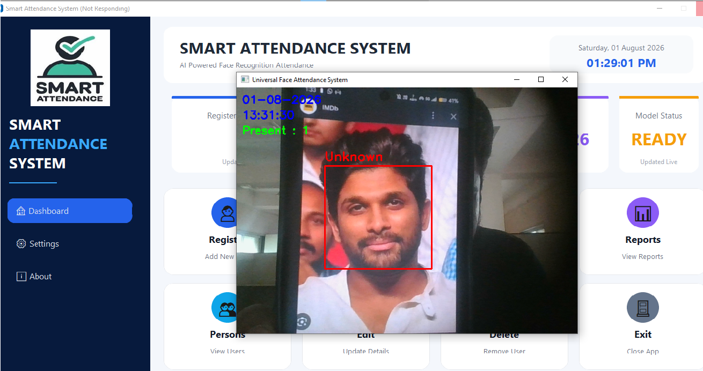

# Smart Attendance System
A modern desktop-based attendance management system that automates attendance using **Face Recognition**. Built with **Python, OpenCV, LBPH Face Recognizer, and CustomTkinter**, the application provides real-time face recognition, automatic attendance recording, user management, and a clean graphical interface. 
- Attendance records are automatically stored with the **Person ID, Name, Date, Time, and Status**, allowing users to access and review attendance reports offline at any time. 
- This system is ideal for **schools, colleges, universities, coaching institutes, offices, corporate workplaces, research laboratories, training centers, libraries, and other organizations** that require a secure, accurate, and efficient attendance management solution.

## Project Preview

### Realtime Dashboard

The dashboard provides an overview of the system, including the total number of registered users, today's attendance count, current date, model status, and quick access to all major functionalities through an intuitive interface.

<p align="left">
  
</p>

---

### Registration Window

Register a new user by entering a unique **Person ID** and **Name**. The webcam then captures multiple facial images, which are used to train the face recognition model.

<p align="left">
  
</p>

---

### Attendance Detection

The system recognizes registered users in real time and automatically records their attendance with the **Person ID, Name, Date, Time, and Status**, while preventing duplicate entries for the same day.

<p align="left">
  
</p>

---

### Unknown Face Detection

Faces that are not registered in the database are identified as **Unknown** and are not included in the attendance records, ensuring reliable and accurate attendance management.

<p align="left">
  
</p>

---

### Attendance Report

View attendance records at any time, including **today's attendance**, **date-wise reports**, and the **complete attendance history** stored by the system.

<p align="left">
  
</p>

---

### View Registered Persons

Display the complete list of registered users along with their unique IDs, making it easy to manage and verify the database.

<p align="left">
  
</p>

---

### Edit Person

Update a registered user's information, such as their name, without deleting and re-registering the person, preserving the existing records and IDs.

<p align="left">
  
</p>

---
## Requirements

You must have **Python 3.11+** installed on your system.

The following Python modules are required:

- OpenCV
- OpenCV-Contrib
- NumPy
- Pillow
- CustomTkinter

---

### OpenCV

OpenCV (Open Source Computer Vision Library) is an open-source computer vision library used for image processing and real-time video analysis. In this project, OpenCV is used for Capturing webcam frames, Detecting faces using Haar Cascade, Displaying the live camera feed, Drawing face bounding boxes

```bash
pip install opencv-python
```
---

### OpenCV-Contrib

OpenCV-Contrib extends OpenCV by providing additional computer vision algorithms. This project uses the **LBPH Face Recognizer** from OpenCV-Contrib to train and recognize registered users.
```bash
pip install opencv-contrib-python
```

---

### NumPy

NumPy is the fundamental numerical computing library for Python. In this project, NumPy is used for processing image arrays during face detection and model training.

```bash
pip install numpy
```

---

### Pillow

Pillow is a Python imaging library used for loading and processing images, In this project, Pillow reads the captured face images from the dataset before they are used for training the recognition model.

```bash
pip install pillow
```

---

### CustomTkinter

CustomTkinter is a modern UI framework built on top of Tkinter, It is used to build the application's graphical user interface, including the dashboard, registration panel, attendance controls, and user management windows.

```bash
pip install customtkinter
```

---

### ⚙ Installation

Clone the repository

```bash
git clone https://github.com/YOUR_USERNAME/smart-attendance-system.git
```

Move into the project

```bash
cd smart-attendance-system
```

Install all dependencies
```bash
pip install opencv-python opencv-contrib-python customtkinter pillow numpy
```
## How to use
Once all dependencies are installed, launch the application:

```bash
python gui.py
```

The application provides the following features:

- **Register Person** – Capture face images for a new user.
- **Train Model** – Train the LBPH face recognition model.
- **Mark Attendance** – Recognize registered users and automatically record attendance.
- **Attendance Report** – View attendance records by date.
- **View Persons** – Display all registered users.
- **Edit Person** – Update user details.
- **Delete Person** – Remove registered users and their face data.

---

## Notes

- Register each person with a unique Person ID.
- Retrain the model after adding or deleting a user.
- Ensure proper lighting for better recognition accuracy.
- Attendance records are stored in CSV format.
- The recognition accuracy depends on the quality of captured images.

---

---
# 👨‍💻 Developer

**Ammar Shaikh**
Passionate about: 
- Robotics
- Artificial Intelligence
- Computer Vision
- Automation
- Generative AI
---

## Support
Contributions are welcome!
Feel free to fork this repository and submit a Pull Request.
If you found this project useful, consider giving it a ⭐ on GitHub.
